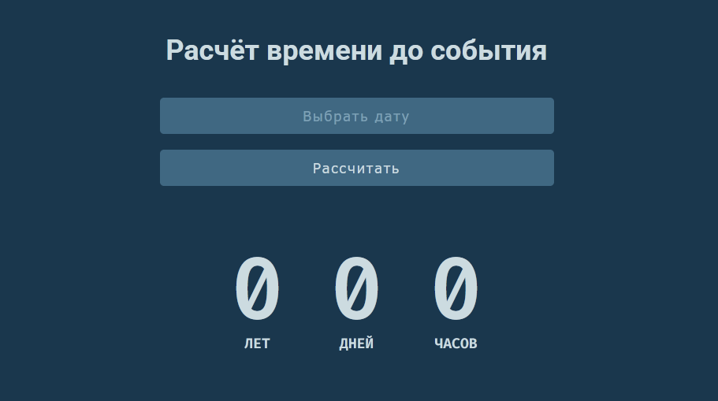

# Day Counter ⏳

Небольшое веб-приложение для расчёта времени, оставшегося до выбранной даты — в годах, днях и часах.



## Возможности

- Выбор даты через удобный календарь ([flatpickr](https://flatpickr.js.org/)) с русской локализацией
- Расчёт полных лет, дней и часов до указанной даты (с учётом високосных лет)
- Минимальная доступная дата в календаре — завтрашний день

## Технологии

- HTML/CSS
- JavaScript (ES-модули)
- [Parcel](https://parceljs.org/) — сборщик
- [moment.js](https://momentjs.com/) — работа с датами
- [flatpickr](https://flatpickr.js.org/) — выбор даты

## Установка и запуск

```bash
# клонировать репозиторий
git clone https://github.com/enotstitch/day-counter.git
cd day-counter

# установить зависимости
npm install

# запустить дев-сервер
npm run dev
```

Приложение откроется по адресу, который выведет Parcel (обычно `http://localhost:1234`).

## Сборка

```bash
npm run build
```

Собранные файлы появятся в папке `dist`.

## Автор

[enotstitch](https://github.com/enotstitch)
